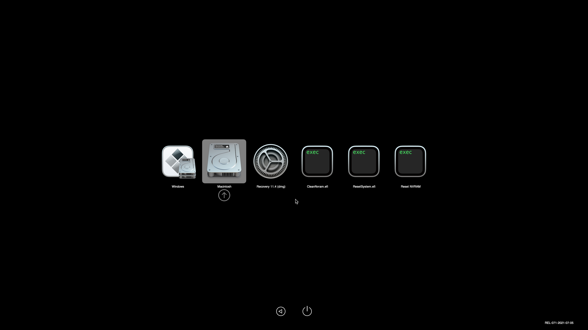
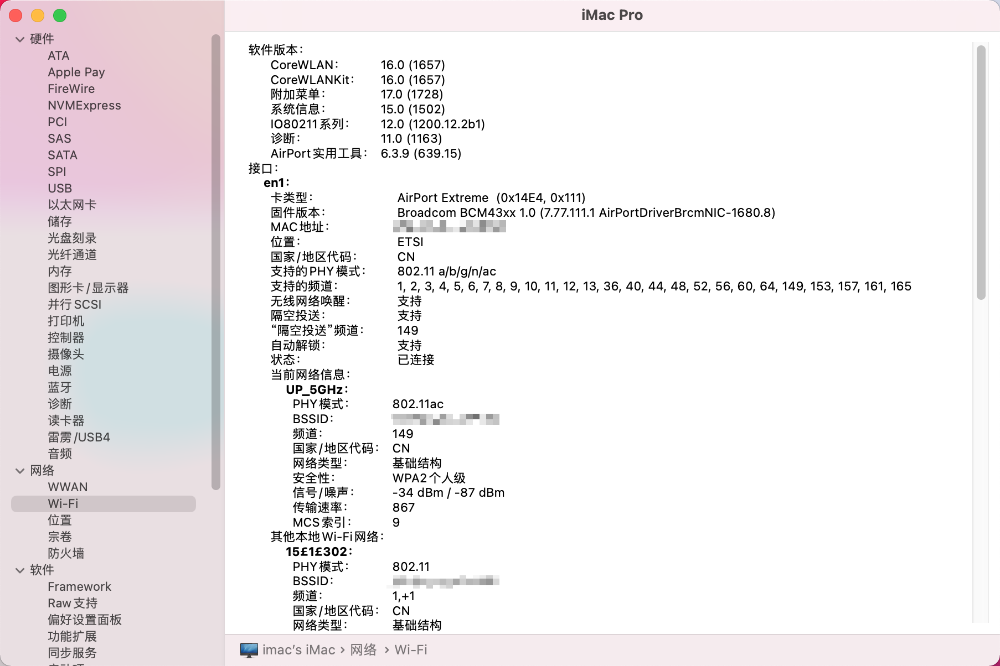
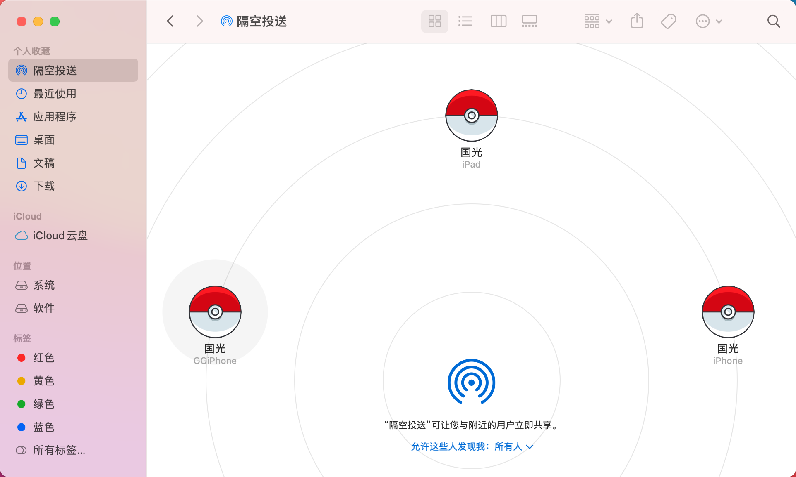
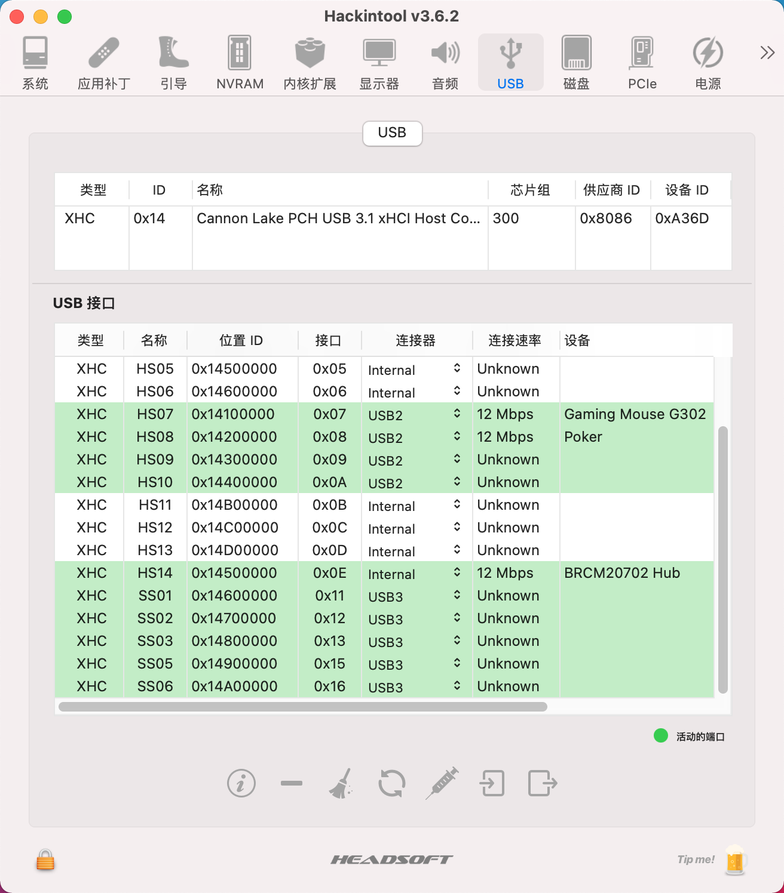

# 中文版

## 配置

macOS Big Sur 11.5 + OpenCore 0.7.1

| 组件 | 名称                   |
| ---- | ---------------------- |
| CPU  | i5 9600KF              |
| 主板 | 技嘉 B360M DS3H        |
| 显卡 | 蓝宝石 RX550 640SP 4GB |
| 机型 | iMac Pro 1,1           |
| 网卡 | Fenvi BCM94360CD       |

## BIOS

- 「BIOS 功能 」-「快速启动」-「关闭」
- 「BIOS 功能 」-「CSM 支持」-「关闭」
- 「BIOS 功能 」-「Security Device Support」-「Disable」
- 「集成外设」-「Software Guaed Extension （SGX）」-「关闭」
- 「集成外设」-「Super IO 配置」-「Serial Port」-「关闭」
- 「集成外设」-「Super IO 配置」-「板载 LPT 端口」-「关闭」
- 「集成外设」-「USB 程序」-「XHCI Hand-off」-「开启」
- 「集成外设」-「SATA Anf RST Configuration」-「SATA Mode Selection」-「启动」
- 「芯片组」-「VT-d」-「关闭」
- 「芯片组」-「4G 以上解码」-「启动」
- 「芯片组」-「IOAPIC 24-119 Entries」-「启动」
- 「芯片组」-「Aperture Siz」-「128MB」

# English version

macOS Big Sur 11.5 + OpenCore 0.7.1

| 组件       | 名称                     |
| ---------- | ------------------------ |
| CPU        | i5 9600KF                |
| Motheboard | GIGABYTE B360M DS3H      |
| GPU        | Sapphire RX550 640SP 4GB |
| SMBIOS     | iMac Pro 1,1             |
| WiFi       | Fenvi T919 BCM94360CD    |

# 驱动情况 What works

- [x] All USB Ports (port mapping performed)
- [x]  All Sensors (CPU, GPU, NVME, SATA, FANS)
- [x]  SpeedStep / Sleep / Wake
- [x]  Wi-Fi and Bluetooth (Fenvi T919)
- [x] Windows 10 boot from OpenCore

## OpenCore 0.7.1

## 系统 OS

 

## WiFi

## GPU

## 短信 iMessage

## Intel Power Gadget

## Geekbench5 CPU

## Geekbench5 GPU

## 隔空投送 AirDrop

## 接力 Handoff

## Hackintool USB

# 打赏 Reward

<table>
    <tr>
        <td>
            

        </td>
        <td width="50%">
            

        </td>
    </tr>
</table>

